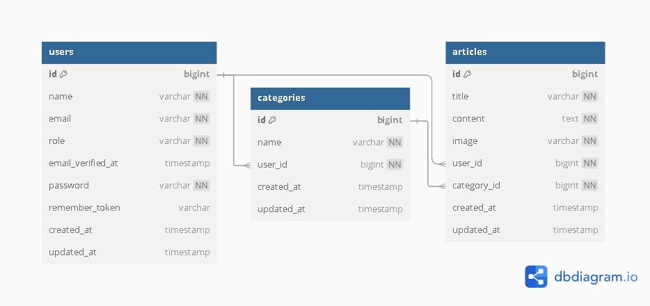
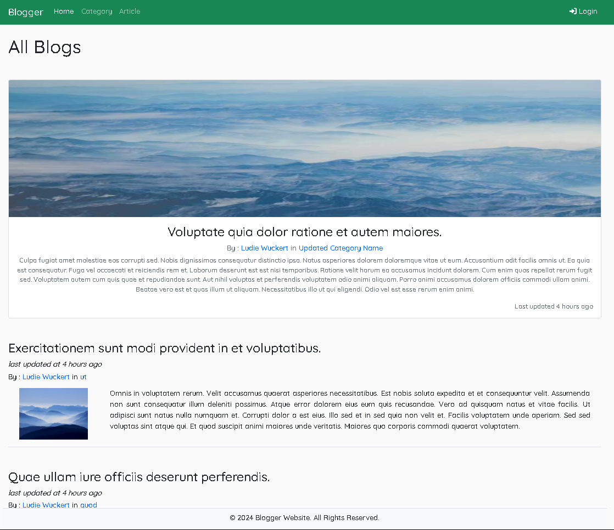
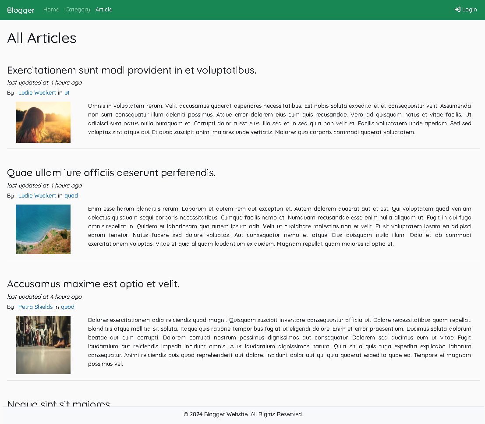
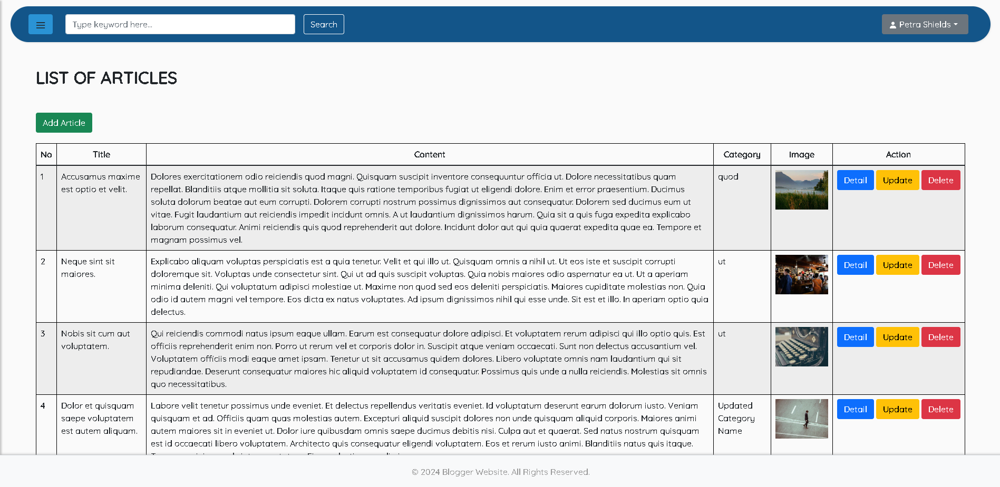

# Simple Blog Application

This is a simple blog web application built with **Laravel 8**. Users can register, log in, and create their own categories and articles. Unauthenticated users can view the categories and articles created by other users but cannot create or modify content.

## Features
- User authentication (registration, login, logout).
- Users can create and manage categories and articles.
- Categories are linked to the user who created them.
- Articles are linked to both a category and the user who created them.
- Unauthenticated users can browse categories and articles but cannot add or edit content.

## Project Structure
The application follows the standard Laravel structure with `Controllers`, `Models`, `Views`, and `Routes`. It uses MySQL for data storage and manages three main entities: `users`, `categories`, and `articles`.

## Database Design

### ERD Diagram
Below is the Entity-Relationship Diagram (ERD) that describes the structure of the application's database.



### Database Tables

1. **Users**
   - Stores user information, including authentication credentials and roles.
   - Each user can create multiple categories and articles.

2. **Categories**
   - Each category is created by a user.
   - A user can have multiple categories.
   - Categories group articles based on the user’s preference.

3. **Articles**
   - Each article belongs to both a category and a user.
   - Articles contain a title, content, and an associated image.

### Relationships
- **Users and Categories**: One-to-Many relationship. A user can create many categories, but each category belongs to only one user.
- **Users and Articles**: One-to-Many relationship. A user can write many articles, but each article is written by only one user.
- **Categories and Articles**: One-to-Many relationship. Each article belongs to a category, and a category can have multiple articles.

## User Roles
- **Authenticated users**: Can create, edit, and delete their own categories and articles.
- **Unauthenticated users**: Can only view categories and articles created by others.

## Installation Instructions

1. **Clone the repository:**
   ```bash
   git clone https://github.com/yourusername/simple-blog-application.git
   cd simple-blog-application
   ```

2. **Install dependencies:**
   Run the following command to install all required dependencies:
   ```bash
   composer install
   ```

3. **Configure environment variables:**
   Copy the `.env.example` file to `.env` and update the necessary configuration (like database credentials).

   ```bash
   cp .env.example .env
   ```

4. **Generate application key:**
   ```bash
   php artisan key:generate
   ```

5. **Run migrations:**
   Run the following command to create the database tables:
   ```bash
   php artisan migrate:refresh --seed
   ```

6. **Run the server:**
   Start the application locally by running:
   ```bash
   php artisan serve
   ```

7. **Access the application:**
   Open your browser and go to `http://localhost:8000`.

## Application Screenshots
Here are some screenshots of the application:

### Home Page (Unauthenticated Users)


### List of Articles


### Management Article Page (Authenticated Users)


## Dependencies

Here are the major dependencies of the application:

- **Laravel 8** - PHP Framework for building the web application.
- **GuzzleHTTP** - HTTP client for making requests.
- **Symfony Console** - For command-line tasks.
- **Composer** - Dependency manager for PHP.
  
To view all installed dependencies, run:

```bash
composer global show -i
```

Some key packages include:
- `guzzlehttp/guzzle`: PHP HTTP client library.
- `symfony/console`: Command line interface for handling artisan commands.
- `phpseclib/phpseclib`: Pure-PHP implementations of SSH, SFTP, RSA, and more.
